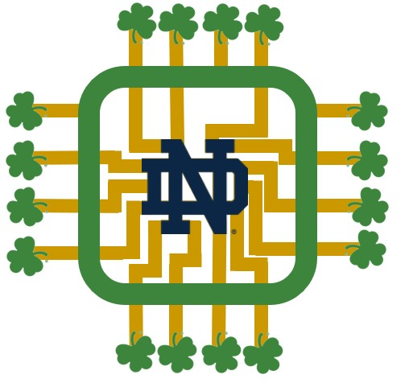

# Signal_Sages

Final Project for CSE 30342 Digital Integrated Circuits

Lydia Csaszar, Dan Schrage, Phyona Schrader, and Kate Mealey

Prof. Matthew Morrison

Notre Dame

### Project: Traffic Light Controller

|------------------------|
|Kogge, P. M. (2022). The Zen of Exotic Computing. United States: Society for Industrial and Applied Mathematics.|
|Ndjountche, T. (2016). Digital Electronics 3: Finite-state Machines. United Kingdom: Wiley.|
